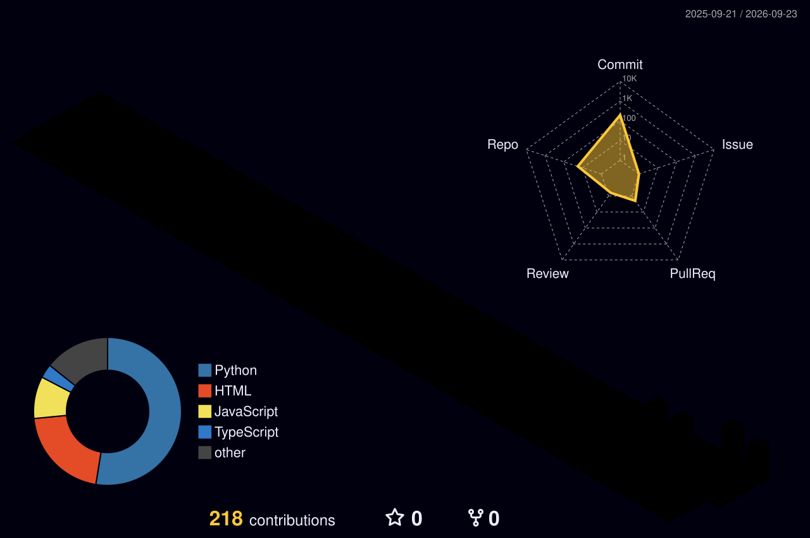

<div align="center">
  
  <h1>✦ Hi, I'm Shoaib! ✦</h1>
</div>
<div align="center">
  
</div>


<div align="center">
  <a href="https://linkedin.com/in/shoaib-ahmad-07b1b0325"></a>
  <a href="mailto:sa7028894@gmail.com"></a>
  <a href="https://github.com/sa7028894-arch"></a>
</div>

---

## About me


```yaml
👤 name: Shoaib Ahmad
🎓 role: Computer Science Undergraduate
🌐 focus: Web Development × Cybersecurity
🛠️ building: modern apps
✨ craft: clean code & exploring cybersecurity
🐧 environment: Arch Linux (GNOME, Niri)
💻 langs: C • C++ • Python • JavaScript • TypeScript
⚛️ frontend: React • Next.js • HTML • CSS • Tailwind CSS • Vite
🧰 tools: Git • Bash • VS Code
⚡ love to: Code • Debug • Break Things 🔨
```

---

## 📊 Stats

<div align="center">
  
  
</div>

<div align="center">
  
  
</div>

<div align="center">
  
</div>

<div align="center">
  
</div>

---

## ⚔ Languages • Frameworks • Tools

<div align="center">
  
</div>

---

<div align="center">
  
  <br>Made with ⚡ by <b>Shoaib</b>
</div>
<div align="center">
  
</div>
